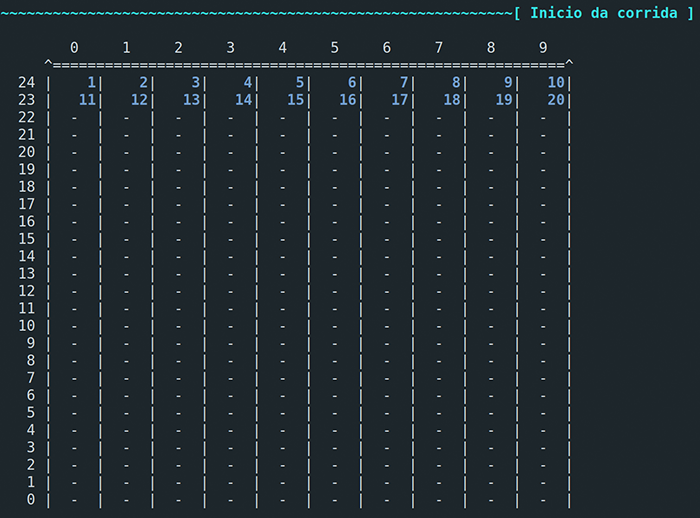
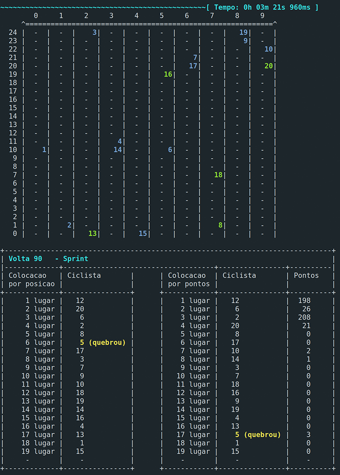
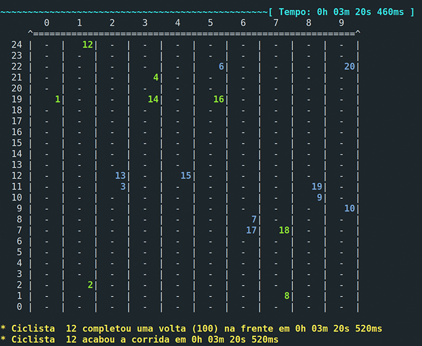
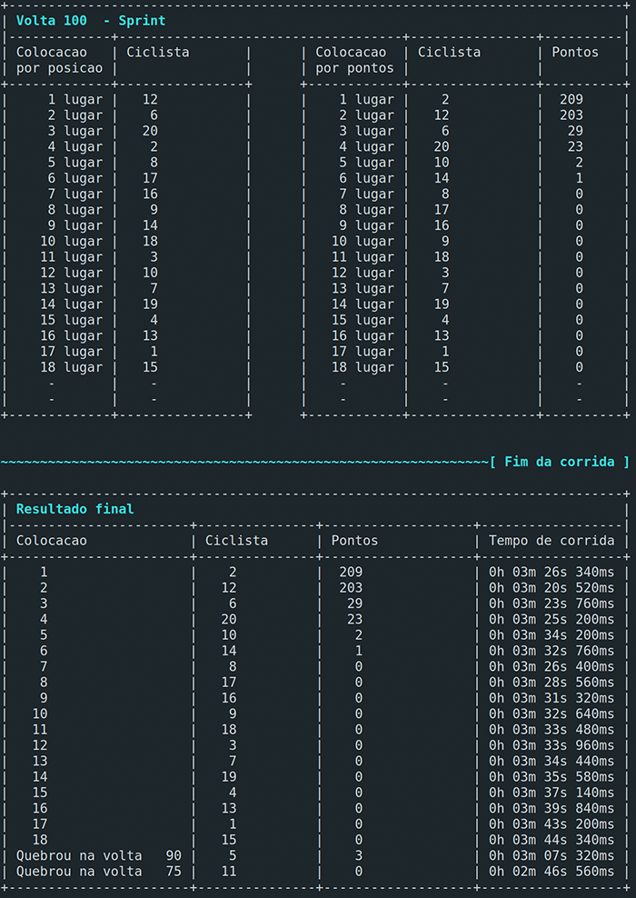

# Cyclist Thread Racing
### Corrida de Threads Ciclistas
2017 | IME-USP | MAC0422 - Sistemas Operacionais - EP2

O enunciado do programa está no arquivo [ep2.pdf](ep2.pdf).

### Execução
Para executar o programa, abra o terminal na pasta do código fonte e digite:
```
$ make
$ ./ep2 <velodrome_length> <number_of_cyclists> <number_of_laps> [debug]
```

Exemplos:
```
$ ./ep2 25 20 100 debug
$ ./ep2 200 40 60
```

### Códigos
Linguagem utilizada: **C**
- [ep2.py](ep2.py)
    - Função principal
    - Recebe as entradas do programa
    - Inicializa as estruturas de dados
- [pista.c](pista.c) e [pista.h](pista.h)
    - Interface com as variáveis globais
- [cyclist.c](cyclist.c) e [cyclist.h](cyclist.h)
    - Estrutura do ciclista
    - Threads
- [error_handler.py](error_handler.py)
    - Manipulador de erro
- [tests.py](tests.py)
    - Testes de eficiência

### Pista
- `Matriz[10][d]`
- Acesso por meio das funções:
    - `void PISTA_set_position (int lane, int pos, int id)`
    - `int PISTA_get_id_in_position (int lane, int pos)`
- Cada vez que um ciclista que está na posição `i` tenta se mover, as posições `i` e `i + 1` da pista são bloqueadas

#### Ciclista
Possui a seguinte estrutura:
- `id`
- `rank`
- `speed`
- `pos`, `lap`, `lane`, `original_lane`
- `pedaled`
- `score`
- `is_broken`, `is_lucky`
- `cur_time`

As cores dos ciclistas têm os seguintes significados:
- **Azul**: 30km/h
- **Verde**: 60km/h
- **Rosa**: 90km/h

### Demonstração
```
$ ./ep2 25 20 100 debug
```



...



...



...


